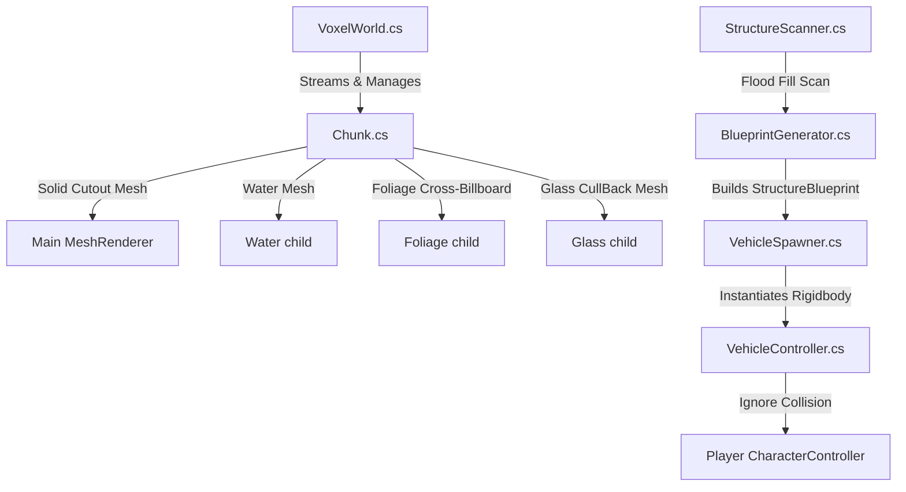

# Unity Voxel Game - Project Context & Rules

This project is a 3D procedural voxel game built in Unity (targeting URP) featuring player-built structures, dynamic physics-based vehicles, buoyancy, a dry interior cabin system, procedural rendering, and a grid-based crafting/inventory system.

---

## 🎮 Core Systems Architecture

### 1. Voxel & Chunk Rendering System
*   **Dimensions**: Chunks are generated dynamically in 3D around the player using standard `VoxelData.ChunkWidth` (16) and `VoxelData.ChunkHeight` (80) limits.
*   **Mesh Segregation**: To optimize performance and solve alpha depth sorting/culling issues, each `Chunk` splits its geometry into four separate sub-meshes:
    1.  **Solid Mesh**: Opaque blocks and solid cutouts (Opaque shader with Alpha Clip/Cutout, writes to Depth).
    2.  **Water Mesh**: Semi-transparent, double-sided rendering (`waterMaterial` on a separate `"Water"` child GameObject).
    3.  **Foliage Mesh**: Double-sided, alpha-cutout, non-convex collider (`foliageMaterial` on a `"Foliage"` child GameObject) for flowers (crossed-quad billboards) and leaves.
    4.  **Glass Mesh**: Transparent, ZWrite On + Cull Back (`glassMaterial` on a `"Glass"` child GameObject) to allow glass borders to render correctly without bleeding through front faces.
*   **World Generation**: Procedural generation uses multi-octave 2D Perlin noise for terrain height, continent noise to scale oceans/land masses, and domain-warping to carve wiggling riverbeds.

### 2. Vehicle Blueprint & Physics System
*   **Scanning**: `StructureScanner.FloodFillStructure` performs a 3D flood fill starting from a Control Block (ID 50) or interaction target, identifying all contiguous player-placed blocks (registered in `PlacedBlockRegistry`) and filtering out natural terrain blocks.
*   **Spawning**: `VehicleSpawner.SpawnVehicle` translates a scanned `StructureBlueprint` into a unified physical GameObject:
    *   Erases the original source blocks from the voxel grid silently (suppressing standard item drops).
    *   Generates a single root `Rigidbody` with scaled mass (e.g., steel/iron blocks increase weight significantly) and custom linear/angular damping.
    *   Constructs procedural 3D visual representations for specialty blocks (wheels and propellers).
*   **Interaction**: Players interact with the Control Block (ID 50) by pressing `E` to pilot the vehicle.
*   **Step Climbing**: `VehicleController.TryClimbStep` performs a fan of horizontal raycasts ahead of the vehicle. If a 1-block terrain step is detected, it directly injects upward position offsets and forward velocity (mass-independent) to glide the vehicle over the seam smoothly.
*   **buoyancy**: Centralized in `VehicleController`. Every block collider of the vehicle hull below the `waterLevel` (14) contributes an upward force relative to its submersed volume, allowing custom hull designs to float.
*   **Dry Interior Cabin**: A dynamic boundary check (`VehicleController.IsWorldPosInsideVehicle`) intercepts water vertex calculations in `Chunk.cs`. Any water voxel coordinates falling inside a vehicle's dry interior filter bounds are suppressed (removed from the water mesh), keeping boat cabins dry.

### 3. Inventory & Crafting
*   **Item System**: Block types and items are defined using `Item` ScriptableObjects (IDs map to block types).
*   **Inventory Rules**:
    *   Items collected or mined must automatically populate the earliest available inventory slots (top-left to bottom-right order).
    *   Inventory stacking uses ID/name comparisons rather than ScriptableObject reference checks to avoid duplication bugs.
    *   Grass-type items override standard sprite loading in favor of procedural 3D block icons via `StarterItems.MakeGrassBlockIcon()`.
*   **Crafting Layouts**: Supports toggling between a 2x2 player inventory grid and a 3x3 table-based crafting interface when right-clicking a placed Crafting Table (ID 36).

---

## 🗂 Voxel Block & Item ID Catalog

| ID | Block Name | Physics / Render Mesh Category | Notes / Custom Behavior |
| :--- | :--- | :--- | :--- |
| **0** | Air | N/A | Ignored |
| **1** | Wood | Solid / Main Mesh | Tree trunk blocks |
| **2** | Plank | Solid / Main Mesh | Building block |
| **3** | Stone | Solid / Main Mesh | Deep underground terrain |
| **4** | Grass | Solid / Main Mesh | Surface terrain block; custom 3D isometric icon |
| **5** | Dirt / Iron | Solid / Main Mesh | Used as Dirt in terrain; historically referenced as Iron in Blueprint tables |
| **7** | Water | Water Mesh / Child Object | Semi-transparent; subject to vehicle dry cabin suppression |
| **8** | Sand | Solid / Main Mesh | Beach terrain block |
| **9** | Rose | Foliage / Crossed Quads | Spawns on grass; crossed-quad rendering |
| **10** | Dandelion | Foliage / Crossed Quads | Yellow flower; crossed-quad rendering |
| **11** | Iris | Foliage / Crossed Quads | Violet flower; crossed-quad rendering |
| **12** | Leaves | Foliage / Main Mesh style | Tree canopy blocks; culled against adjacent leaves |
| **20** | Small Wheel | Special / Sphere Collider | Vehicle wheel; Zero-friction glide physics material |
| **21** | Large Wheel | Special / Sphere Collider | 2x2 voxel footprint; offset to visual center during spawn |
| **22** | Propeller | Special / Box Collider | Propeller thruster; automatically oriented relative to hull |
| **23** | Large Wheel Helper | Special / Placeholder | Voxel placeholder for 2x2 footprint; deleted on spawn |
| **30** | Coal Ore | Solid / Main Mesh | Mining resource |
| **31** | Iron Ore | Solid / Main Mesh | Mining resource |
| **32** | Gold Block | Solid / Main Mesh | Luxury decorative block |
| **33** | Iron Block | Solid / Main Mesh | High mass/durability structural block |
| **34** | Sand (Alternative) | Solid / Main Mesh | Alternative sand index |
| **35** | Glass | Glass Mesh / Child Object | Transparent; ZWrite On + Cull Back; shatters on break (no drop) |
| **36** | Crafting Table | Solid / Main Mesh | Interacting opens 3x3 crafting grid |
| **50** | Control Block | Solid / Main Mesh | Yellow hazard stripes; pilot interface for vehicle conversion |

---

## ⚠️ Critical Development & Coding Guidelines

1.  **Ignore Foliage Colliders during Physics updates**:
    *   All foliage components (flowers/leaves) in `Chunk.cs` are placed on the `Foliage` child GameObject.
    *   Avoid using triggers for foliage; standard colliders with `Physics.IgnoreCollision` are used so standard block-breaking raycasts can hit them without spawning warning messages.
2.  **Vehicle Coordinate Offsets**:
    *   Always align spawned block colliders exactly with the voxel grid coordinates using a half-unit center offset (`new Vector3(0.5f, 0.5f, 0.5f)`) relative to the vehicle origin.
    *   Ensure Large Wheels (ID 21) are offset by their visual center (1 unit up, 0.5 units side) to align the physics SphereCollider correctly with the 2x2 structural bounds.
3.  **Player Character Controller Parameters**:
    *   To navigate 2-block high voxel passages, keep the player's CharacterController height at `1.8`, vertical center at `0.9`, stepOffset at `0.4`, and radius at `0.3`.
4.  **No Parenting for Controlled Players**:
    *   Do not parent the player to a vehicle Rigidbody when driving (this causes camera tilting/flickering). Instead, cache the local offset in yaw-only space and manually update player positioning in `LateUpdate` or `Update` relative to vehicle yaw.
5.  **Preserve Custom Procedural Sprite Generation**:
    *   Do not replace programmatic sprite/texture generation methods (`StarterItems.MakeBlockIcon`, `MakeGrassBlockIcon`, etc.) with legacy asset loading unless specifically asked, as it breaks asset independence.
